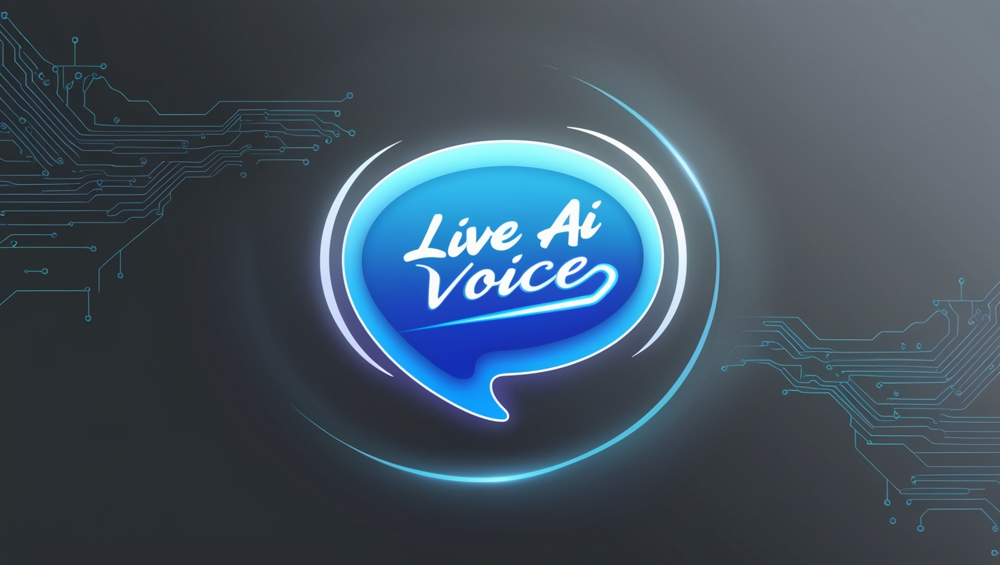

*Image generated by Leonardo.ai*

    

# LiveAIVoiceChat

LiveAIVoiceChat is a demo application that allows users to interact with OpenAI's GPT-3.5-turbo model using voice commands. 
The application captures speech input, sends it to the OpenAI API, and streams the response back to the user. 
This demo showcases the integration of speech recognition, OpenAI API interaction, and speech synthesis in a Blazor WebAssembly application.

## Table of Contents

- [Features](#features)
- [Getting Started](#getting-started)
  - [Prerequisites](#prerequisites)
  - [Installation](#installation)
- [Usage](#usage)
- [Code Overview](#code-overview)
  - [OpenAIService.cs](#openaiservicecs)
  - [Chat.razor](#chatrazor)
  - [Program.cs](#programcs)
- [Contributing](#contributing)
- [License](#license)

## Features

- **Voice Interaction**: Start and stop voice recognition using a button.
- **OpenAI Integration**: Send recognized speech to OpenAI's GPT-3.5-turbo model and receive streamed responses.
- **Speech Synthesis**: Convert the AI's text response back to speech.

## Getting Started

### Prerequisites

- [.NET 8 SDK](https://dotnet.microsoft.com/download/dotnet/8.0)
- [Node.js](https://nodejs.org/) (for Blazor WebAssembly development)
- An OpenAI API key

### Installation

1. Clone the repository:

```bash
	git clone https://github.com/yourusername/LiveAIVoiceChat.git cd LiveAIVoiceChat
```

2. Set your OpenAI API key as an environment variable:

- On Windows:

**Command Prompt**:

```bash
	setx OPENAI_API_KEY "your-openai-api-key"
```

**PowerShell**:
	
```bash
[System.Environment]::SetEnvironmentVariable("OPENAI_API_KEY", "your-openai-api-key", "User")
```

- On macOS/Linux:
	- Add the following line to your shell profile (e.g., `.bashrc`, `.zshrc`):

```bash
	export OPENAI_API_KEY="your-openai-api-key"
```

 - Reload the shell profile:

```bash
	source ~/.bashrc
```
or
```bash
	source ~/.zshrc
```

3. Restore the dependencies and build the project:

```bash
	dotnet restore dotnet build
```

4. Run the application:

```bash
	dotnet run --project LiveAIVoiceChat.Client
```

## Usage

1. Navigate to the `/chat` page in your browser.
2. Click the "Start Speaking" button to begin voice recognition.
3. Speak your question or prompt.
4. The recognized speech will be displayed, and the AI's response will be streamed back and spoken aloud.

## Code Overview

### OpenAIService.cs

The `OpenAIService` class is responsible for interacting with the OpenAI API to get streamed responses from the GPT-3.5-turbo model.

#### Key Methods

- **Constructor**: Initializes the `HttpClient` and sets the API key.
- **GetStreamedResponseAsync**: Sends a prompt to the OpenAI API and processes the streamed response.
- **HandleJsonResponse**: Deserializes the JSON data and accumulates the content.

#### Example Usage

```csharp
// Client side call to OpenAIService and passing a recording 
// Stream response from OpenAI API using recognized speech 
private async Task StreamResponseFromOpenAI(string prompt) 
{ 
	response = ""; 
	// Clear previous response 
	await OpenAIService.GetStreamedResponseAsync(prompt, OnDataReceived); 
}
```

### Chat.razor

The `Chat.razor` component provides the UI for interacting with the OpenAI service using voice commands.

#### Key Elements

- **HTML**: Contains the UI elements for starting voice interaction and displaying the recognized speech and AI response.
- **JavaScript**: Handles speech recognition and speech synthesis.
- **C# Code**: Manages the state and interactions with the OpenAI service.

#### Key Methods

- **StartVoiceInteraction**: Starts the voice interaction process.
- **StreamResponseFromOpenAI**: Streams the response from the OpenAI API using the recognized speech.
- **OnDataReceived**: Callback method for processing streamed data.
- **Speak**: Converts text to speech using the browser's speech synthesis API.
- **StartListening**: Starts speech recognition using JavaScript interop.
- **StopListening**: Stops speech recognition using JavaScript interop.

### Program.cs

The `Program.cs` file sets up the Blazor WebAssembly application and registers the necessary services.

#### Key Elements

- **HttpClient**: Configured with the base address of the host environment.
- **MudBlazor**: Added for UI components and services.
- **OpenAIService**: Registered as a scoped service for dependency injection.

#### Example

```csharp
internal class Program 
{ 
	static async Task Main(string[] args) 
	{ 
		var builder = WebAssemblyHostBuilder.CreateDefault(args);
		builder.Services.AddScoped(sp => new HttpClient { BaseAddress = new Uri(builder.HostEnvironment.BaseAddress) });
		builder.Services.AddMudServices();
		builder.Services.AddScoped<OpenAIService>();
		await builder.Build().RunAsync();
	}
}
```

## Contributing

Contributions are welcome! Please open an issue or submit a pull request for any improvements or bug fixes.

## License

This project is licensed under the MIT License. See the [LICENSE](LICENSE) file for details.
